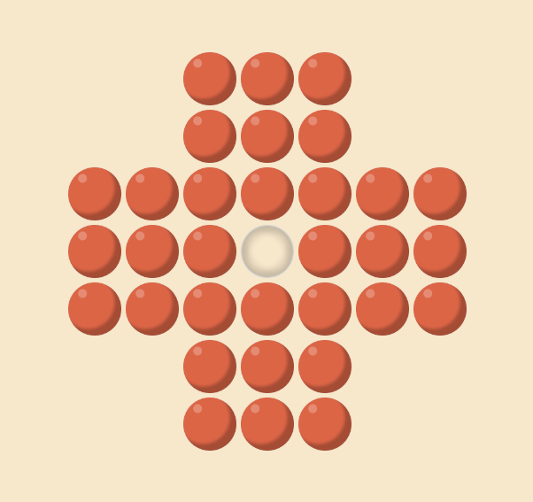

# Marble solitaire solver

## Description :

The objective of this project is to solve the Marble solitaire game.

### **Game Rules :**

#### **Win Condition**

To win the Marble Solitaire game, you must remove all marbles except one. The final marble must end up in the center of the board.

#### **Allowed Moves**

A marble can move by jumping over an adjacent marble into an empty space directly on the other side. The jump can be:

- **Horizontal**: Moving left or right.
- **Vertical**: Moving up or down.

Diagonal jumps are not allowed. The marble that is jumped over is removed from the board.

Here is what the game looks like:

- At the initial state :

  

- At the final state

  

## Solving Process

### Step 1: Optimizing the Board

The board is represented as a binary number, where each bit corresponds to a specific position:  

- **1** indicates the position is occupied by a marble.  
- **0** indicates the position is empty.

For more details, refer to the [optimized board representation](./step1.md).

---

### Step 2: Exploring Possible Moves

With the optimized board representation, the game can be solved by exploring all possible moves systematically.

However, due to the vast number of possible moves, this approach alone is inefficient.

For more details, refer to the [solving process explanation](./step2.md).

---

### Step 3: Using Transposition Tables

To improve efficiency, transposition tables are introduced. These tables store previously explored board states to avoid redundant calculations.

Key considerations for implementing transposition tables include:

- **Hashing the board state:** Ensure symmetrical states are treated as identical.
- **Integrating with the solving process:** Use the hash to skip duplicate states during exploration.

For more details, refer to the [transposition table implementation](./step3.md).